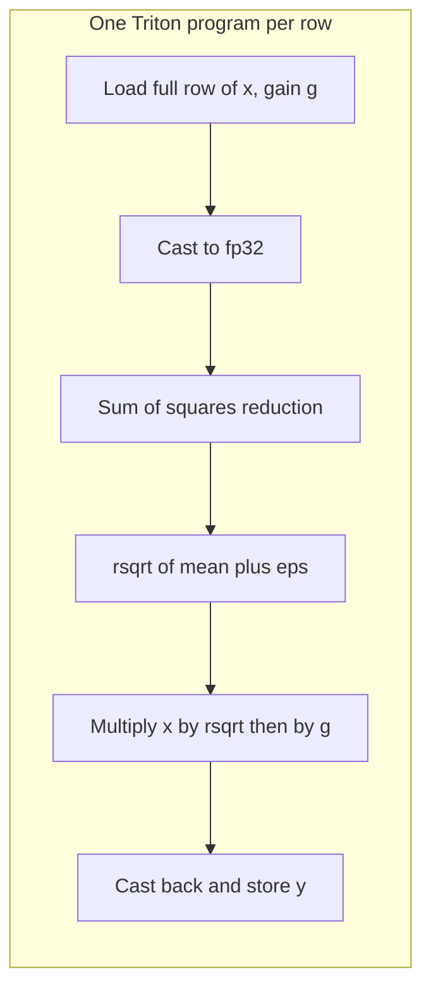

# Fused RMSNorm

> **Status: draft — kernel + tests on disk, no GPU numbers yet.** The design and
> correctness strategy are documented here. The benchmark results section is
> deliberately empty until the kernel runs on an A100; stub tables with
> placeholder numbers would be worse than no table at all.

RMSNorm is the per-token normalization used by every modern open-weights LLM
(LLaMA, Mistral, Qwen, Gemma). This kernel fuses the entire operation into one
HBM round trip per row, targeting 80–90% of A100 HBM peak (~1.6–1.8 TB/s).

## 1. Math

For a row vector `x ∈ R^N` (one token's hidden state), a learned gain
`g ∈ R^N`, and stability epsilon `ε`:

```
RMSNorm(x)_i = g_i * x_i / sqrt( (1/N) * Σ_j x_j^2 + ε )
```

Contrast with LayerNorm, which additionally subtracts the mean and adds a bias:

```
LayerNorm(x)_i = g_i * (x_i - μ) / sqrt(σ² + ε) + b_i
```

The RMSNorm paper (Zhang & Sennrich, 2019, arXiv 1910.07467) argues that the
mean-subtraction step contributes little; only the *re-scaling* invariance
matters. Dropping it saves one reduction and one bias broadcast — small on paper,
significant in a memory-bound regime where every extra tensor pass costs an
entire HBM traversal.

**Why `ε` lives inside the sqrt, not outside.** Placing it inside the radicand
bounds the divisor away from zero *before* the sqrt takes it; placing it
outside would still allow the sqrt to underflow for extremely small activations.
The inside-the-sqrt form is what PyTorch's `F.rms_norm` uses, and matching that
convention is what makes the ref-vs-ref test possible.

**Why fp32 accumulation is required.** The reduction sums N squared values.
For `N = 4096` fp16 activations with unit-variance scale, the running sum
exceeds fp16's exact-integer range (2¹¹ = 2048) partway through and starts
rounding every subsequent add. Load fp16/bf16, cast to fp32, reduce and rsqrt
in fp32, cast back at store time.

## 2. Kernel design



- **Row-parallel launch.** Grid is 1-D of size `M` (total tokens). Each program
  handles exactly one row. Rows are independent so no cross-program
  communication is needed.
- **BLOCK_SIZE = next_power_of_2(N).** The full row fits in one tile. This is
  the standard Triton layer-norm-tutorial pattern; for LLaMA hidden dims
  (4096 / 5120 / 8192) the row lives comfortably in per-SM SRAM.
- **Single-pass, fused arithmetic.** Load once, compute sum-of-squares → rsqrt
  → scale by weight → store. No intermediate tensors materialized to HBM.
- **fp32 accumulation.** Enforced by `tl.load(...).to(tl.float32)` before the
  reduction.
- **Autotune scope.** `BLOCK_SIZE` is pinned by the input shape, so the useful
  sweep is `num_warps ∈ {1, 2, 4, 8, 16}` and `num_stages ∈ {2, 3, 4}`, keyed on
  `N`.

## 3. Correctness strategy — two-layer defense

A single reference implementation can be silently wrong. If both our
`rmsnorm_ref` and our Triton kernel share the same bug, all tests pass and the
kernel ships broken. We anchor the reference itself:

```
torch.nn.functional.rms_norm  ←  rmsnorm_ref  ←  Triton kernel
        (PyTorch built-in)       (our impl)         (our impl)
```

- `test_ref_matches_torch_functional` compares `rmsnorm_ref(x, w, eps)` against
  `F.rms_norm(x, [N], w, eps)` across the full shape/dtype grid.
- `test_rmsnorm_matches_reference` compares the Triton kernel against
  `rmsnorm_ref` across the same grid.

If a test in the first group fails, we fix the reference. If a test in the
second group fails (while the first passes), the bug is in the Triton kernel.
The split gives us localized diagnostics for free.

## 4. Benchmark plan

Configuration planned for the first run: `M = 4096` rows,
`N ∈ {1024, 2048, 4096, 5120, 8192}`, fp16 and bf16, A100 80GB SXM.

Baselines:

1. **PyTorch eager unfused** — the naive
   `x * torch.rsqrt(x.pow(2).mean(-1, keepdim=True) + eps) * weight`.
   This is the "what fusion buys you" honest number.
2. **`torch.nn.functional.rms_norm`** — PyTorch's built-in fused path.
   Apples-to-apples ceiling for a framework-provided op.
3. **`torch.compile`** — reported for completeness only. `torch.compile`
   itself lowers to Triton; matching it is expected, exceeding it is where
   hand-tuning starts to earn its keep. See `DECISIONS.md`.

**Benchmark results and the bandwidth chart will be inserted here after the
first A100 run.** No stub table or placeholder image — once numbers exist
they go here with full GPU attribution, and the roadmap bullet in the README
flips to `[x]`.

## 5. Roofline analysis

RMSNorm is textbook memory-bound.

**Bytes moved per row** (fp16 input, fp16 output):
- Read x: `N * 2` bytes
- Read weight: `N * 2` bytes (but broadcast/cached across rows — see caveat below)
- Write y: `N * 2` bytes
- **Total per row (row 1):** `6 * N` bytes.
- **Total per row (rows 2..M):** `4 * N` bytes if weight stays L2-resident.

**FLOPs per row:** `N` squares + `N` sums (reduction) + `2N` scales ≈ `4N`.

**Arithmetic intensity:** `4N FLOPs / 4N bytes = 1 FLOP/byte`.

The A100's balance point (peak-compute / peak-BW) is roughly `19.5 TFLOPS / 2.0 TB/s ≈ 10 FLOPs/byte`. We're at 1 FLOP/byte, an order of magnitude below the balance point — decisively memory-bound. **Wall-clock is dominated by HBM traffic; the FLOPs are free.**

**Target achieved bandwidth as % of A100 HBM peak (2.0 TB/s): 80–90%.** The
actual number lands here after the first run; "we targeted X and achieved Y"
is the whole point of the roofline exercise.

## 6. Lesson learned

Reserved for the biggest surprise from the autotune sweep or a
benchmark-hygiene bite (L2 cache reuse, warm-up count, numerical issues
at `N=8192` bf16, etc). Deliberately not pre-written — the lesson is
whichever thing we actually hit on the GPU, not whatever I'd speculate about
from a Mac.
