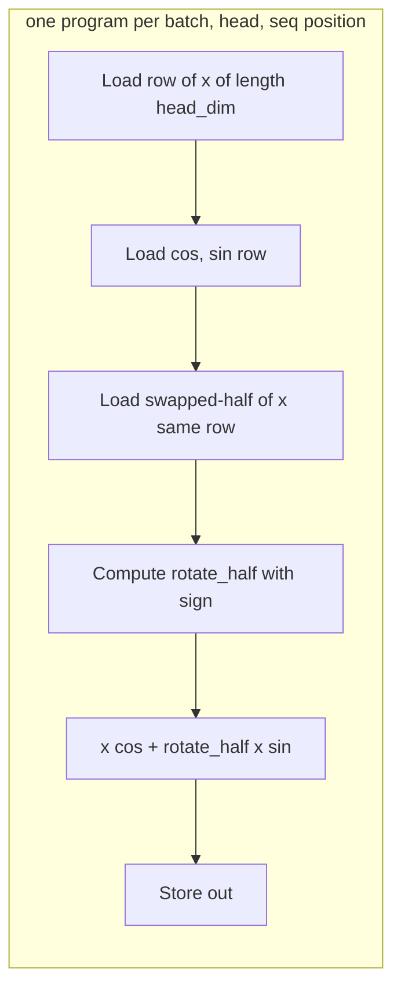

# Fused Rotary Position Embedding (RoPE)

> **Status: draft — kernel + tests on disk, no GPU numbers yet.**

Applies RoPE to the Q and K tensors coming out of the QKV projection, using
the HuggingFace / LLaMA "rotate_half" convention. The matmul itself is left
to cuBLAS.

## 1. What RoPE does

RoPE encodes absolute position into Q and K by rotating pairs of dimensions
by a position-dependent angle. The dot product `Q^T K` then naturally
encodes *relative* position, which is what attention actually needs.

For a vector `x` of length `head_dim` at position `pos`:

```
out[i] = x[i] * cos(pos * theta_i) + rotate_half(x)[i] * sin(pos * theta_i)
```

where `theta_i = base^(-2i/head_dim)` with `base = 10000` (LLaMA 1/2) or
`500000` (LLaMA 3). `cos` and `sin` are typically precomputed by the model
and passed in.

## 2. The two RoPE conventions (and the one we chose)

RoPE has two equivalent-up-to-weight-permutation conventions:

| convention        | rotate_half definition                       | used by                 |
|-------------------|----------------------------------------------|-------------------------|
| interleaved pairs | pair up `(x[2i], x[2i+1])`, apply 2D rotation| original RoPE paper, Meta llama repo |
| rotate half       | `rotate_half([a, b]) = [-b, a]` where `a, b` are each half of the vector | HuggingFace, every HF LLaMA checkpoint |

**This kernel implements the rotate-half convention** because every open
LLaMA checkpoint on HuggingFace was trained against it. If you feed an
interleaved-pairs convention set of weights into this kernel, Q^T K will
produce silently wrong attention scores — the model will not crash, it
will just hallucinate differently. We assert nothing about this at the
API level because there's no reliable runtime signal to distinguish
the two conventions; it's a contract between the caller and the kernel.

## 3. Scope: no QKV matmul

The kernel takes already-projected Q and K tensors (shape `(B, H, S, D)`)
and applies RoPE. It does NOT include the `x -> xW_q, xW_k, xW_v` matmul.

Why: cuBLAS/cutlass GEMM is extremely hard to beat with hand-rolled Triton.
The one time it's worth fusing a GEMM with its epilogue is when the
epilogue is non-trivial AND the intermediate materialization is expensive
(e.g. flash-attention). For RoPE the materialized Q, K are small, and the
epilogue (one multiply + one add + one swap-halves) is cheap. Fusing the
matmul in would mean swapping cuBLAS for a hand-rolled Triton GEMM — a
losing trade on NVIDIA.

See `DECISIONS.md` for the full version.

## 4. Kernel design



- Grid shape `(B * H * S,)`. Each program handles one `(b, h, s)` triplet.
- Row of length `head_dim` lives entirely in one tile; `BLOCK_SIZE =
  next_power_of_2(head_dim)`. For LLaMA head_dim=128, BLOCK_SIZE=128.
- cos and sin are 3-D `(B, S, D)` — same values broadcast across heads.
  The L2 cache serves the heads-of-the-same-row loads after the first head.
- Two loads of `x` per program: one direct, one at swapped offsets for
  the `rotate_half` term. Second load is an L1/L2 hit — same row.
- Q and K are processed via two separate launches of the same kernel. GQA
  (num_heads_q != num_heads_kv) is handled by the launch grids.

## 5. Benchmark plan

Configurations:

| config         | B | H_q | H_kv | S    | D   |
|----------------|---|-----|------|------|-----|
| LLaMA-2 7B MHA | 1 | 32  | 32   | 2048 | 128 |
| LLaMA-3 8B GQA | 1 | 32  | 8    | 2048 | 128 |
| LLaMA-3 8B GQA | 1 | 32  | 8    | 4096 | 128 |
| LLaMA-3 70B GQA| 1 | 64  | 8    | 2048 | 128 |

Baselines: eager (`apply_rope_ref`), `torch.compile(apply_rope_ref)`.

Results and chart land here after the first A100 run.

## 6. Lesson learned

Deferred until GPU validation.
