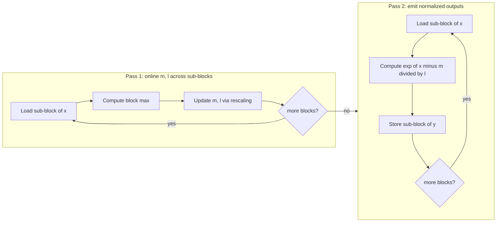

# Online softmax

> **Status: draft — kernel + tests on disk, no GPU numbers yet.**

Numerically-stable softmax computed with the Milakov & Gimelshein (2018)
online formulation. Softmax is applied over the last dim of a tensor of
any rank.

## 1. Three flavors of softmax

Given a row `x` of length `N`:

**Naive:**
```
y = exp(x) / sum(exp(x))
```
Overflows for `|x| > ~88` in fp32, `|x| > ~11` in fp16. Unusable in practice.

**Safe (standard):** take two passes.
```
m = max(x)
y = exp(x - m) / sum(exp(x - m))
```
Numerically stable. This is what `F.softmax` and most hand-written softmax
implementations do.

**Online (streaming):** process `x` in sub-blocks. Maintain `(m, l)` where
`m` is the max seen so far and `l` is `sum(exp(x_seen - m))`. For each new
sub-block:

```
m_new = max(m, max_of_block)
l_new = l * exp(m - m_new) + sum(exp(block - m_new))
m, l = m_new, l_new
```

The rescaling `l * exp(m - m_new)` is the clever bit: when the max shifts
up, every previously-accumulated `exp(x - m)` is `exp(m_new - m)` times too
large and gets corrected in one multiply.

## 2. Why online matters here

For rows that fit in one SRAM tile, online softmax and safe softmax
produce identical outputs with identical performance — safe softmax just
does the two passes with one `tl.max` and one `tl.sum`. **Online only
wins when the row doesn't fit in one tile.**

That's not currently the case in our benchmark (all configs have `N` small
enough to fit), but we implement the online version anyway because:

1. The name on the roadmap is "online softmax" — so we build what it says.
2. It generalizes directly to streaming attention (FlashAttention) in later
   phases.
3. It demonstrates the running-state pattern that's a recurring motif in
   high-performance kernels.

The kernel takes a `block_size` arg; set it smaller than `N` to actually
exercise the online loop. The benchmark deliberately includes `N = 16384`
to force multiple iterations.

## 3. Kernel design



- One Triton program per row. Grid shape `(M,)`.
- Each program iterates over its row in `BLOCK_SIZE` sub-blocks, twice.
- fp32 accumulators for `(m, l)` — the exponentiation is where
  low-precision bites hardest.
- The two-pass structure means this kernel moves `x` through HBM twice
  per call. That's one more pass than a safe-softmax kernel that holds
  the full row in SRAM, so for small `N` this will be slightly slower
  than `F.softmax`. The point stands: online wins when the row doesn't
  fit, and the benchmark will show both regimes.

## 4. Benchmark plan

Shapes: `(M, N)` for `(32, 512)`, `(32, 2048)`, `(32, 4096)`,
`(32, 16384)`, `(128, 4096)`. The `N=16384` row exercises the online
loop meaningfully — expected to be where the Triton kernel pulls away
from naive eager softmax (which can't hold the row in SRAM either and
pays the materialization cost explicitly through HBM).

Baselines: eager naive two-pass, `F.softmax`, `torch.compile`.

Results and chart land here after the first A100 run.

## 5. Lesson learned

Deferred until GPU validation.
